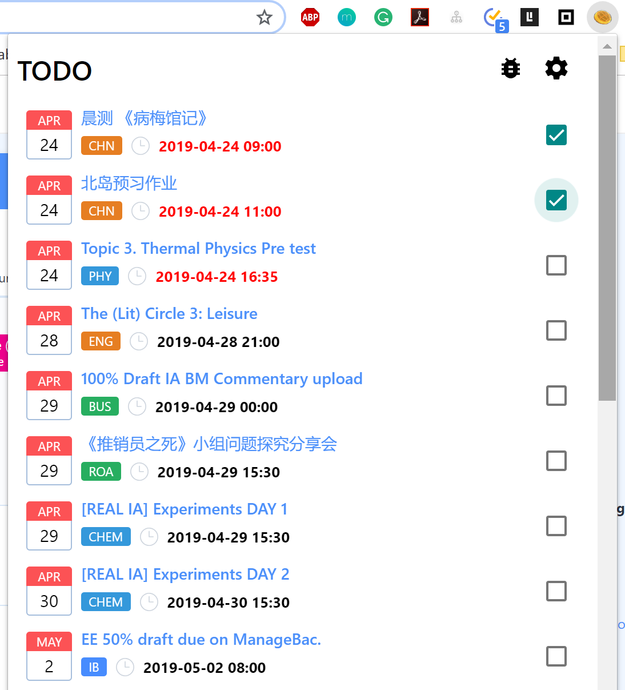

# Check Box Feature

How about clicking the **Managebaker icon** upright in your Chrome Extension?

See the small check boxes besides pieces of tasks?

That's where you can **tick your task** to show your completion.

At the same time, go to the dashboard page to see what happened.

Your task has been already ticked! 
