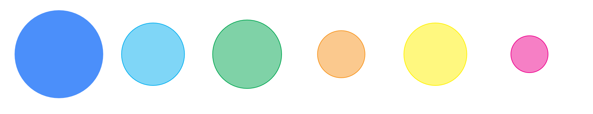

# Grade Chart Feature

Notice the **extra line** below your horrible grade charts? 

That's where the grade chart is! Click the **coloured bubble** icon on the right.

Then several bubbles have popped up!

Each bubble stands for **each category** in your subject assessment.

Move your mouse on the bubbles, you'll see your average % scores.

But notice that, it's your **academic year** grade by default.

To switch to **current term** grade, you can choose on your grade chart.

You can double check with the grade chart line.

How about double-clicking?

