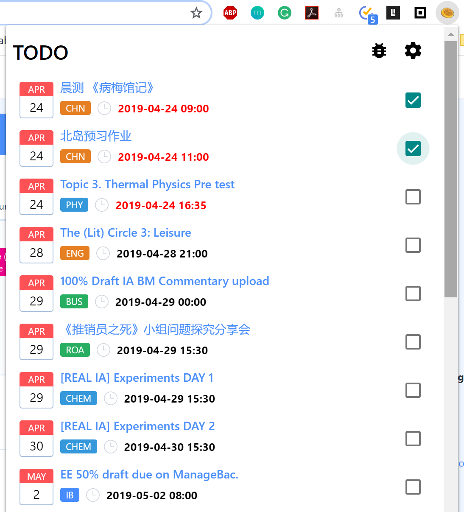
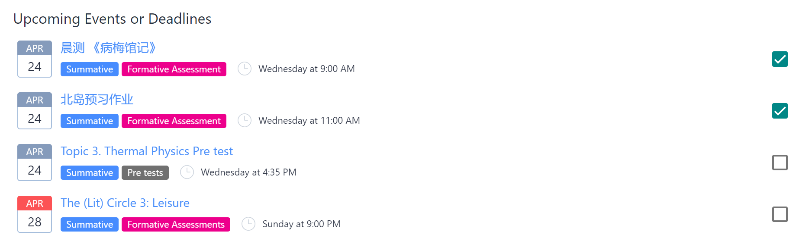
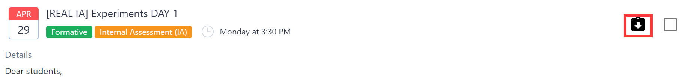

# Quick Start to Experience ManageBaker

## Grade Chart Feature

Notice the **extra line** below your horrible grade charts? 

That's where the grade chart is! Click the **coloured bubble** icon on the right.

Then several bubbles have popped up!

Each bubble stands for **each category** in your subject assessment.

Move your mouse on the bubbles, you'll see your average % scores.

How about double-clicking?

## Check Box Feature

How about clicking the **Managebaker icon** upright in your Chrome Extension?

See the small check boxes besides pieces of tasks?

That's where you can **tick your task** to show your completion.

At the same time, go to the dashboard page to see what happened.

Your task has been already ticked! 

## ZIP Download Feature

Oh gosh your teacher has put several attachments again! Worrying about your storage? Now look at the assignment page carefully......

See what? A **black download icon** right behind the title!

By clicking that, you can download all the files in ZIP~~

## Key Shortcuts

If you are looking for the way to **Logout** and your **profile**, 

Head for **Utilities** and find them below~

## Ways to Report Issues

For more information, please head for [Managebaker Discussion Forum](https://managebaker.com/discuss/](https://managebaker.com/discuss/).

Free to contact us!
